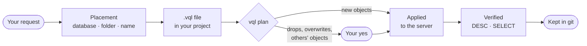

<div align="center">

# Denodo Skills

**Describe the Denodo objects you need. The agent writes the VQL, applies it, and proves it reads.**

A [Claude Code](https://claude.com/claude-code) plugin for **Denodo 9.5** — sixteen skills that
take a request from plain language to a data product a consumer can browse.

[](https://github.com/kirivandubai/denodo_wipe_coading_skills/actions/workflows/ci.yml)
[](#requirements)
[](#install)
[](LICENSE)

[Install](#install) · [Quick start](#quick-start) · [Skills](#the-skills) · [Safety](#safety) · [Contributing](CONTRIBUTING.md)

</div>

---

You say what you want —

> *Onboard these return files and give me a mart of returns by store.*

— and the agent decides where each object belongs, writes the VQL into a file in your project,
applies it to a live Virtual DataPort server, and checks that what it made actually reads.

- **Files, not clicks.** The agent writes the VQL into files in your repository and applies the
  files, so what it builds is reviewed, committed, promoted and rebuilt like any other code.
- **Your conventions.** Databases, layer folders and names follow Denodo's naming conventions out
  of the box, or your own standard in one markdown file.
- **Creates freely, destroys only with your yes.** Anything that drops, overwrites or touches what
  others use waits for you — and on a production profile the tool itself refuses, whatever the
  agent believes.
- **Honest about what was tested.** Every template says whether it ran on a live 9.5.1 server or
  comes from the documentation alone, and one command re-runs them all on yours.
- **Any deployment.** A container, a VM, a managed instance, a cluster behind a load balancer: all
  the plugin needs to know about your server is in a profile.

## How it works

**The VQL goes into a file in your project, and the file is what gets applied.** That is the
rule the whole plugin is built around:



Objects that live only on a server exist in no artifact: nobody can review them, promote them to
the next environment, or rebuild them after a rollback. Data Marketplace and Denodo Scheduler are
the exceptions to the VQL part — separate servers driven by REST — but the rest of the loop is the
same.

Naming follows conventions adapted from Denodo's *VDP Naming Conventions* (`ds_`, `bv_`, `iv_`,
`a_`, numbered layer folders). A project with its own standard overrides them in
`.denodo/conventions.md` — plain markdown, no schema to learn — and a database that already holds
objects is extended in its own style, not the defaults.

## Requirements

| You need | For | Notes |
|---|---|---|
| **Claude Code** on macOS or Linux | everything | CI runs on Linux; Windows is untested |
| **Denodo 9.5** | everything | 9.5 only — no version branches in the templates, nothing tested on 8.x or earlier 9.x |
| Network access to **Virtual DataPort** | everything | port `9996` by default (the profile sets it), and an account allowed to create objects |
| **Python 3.11** or newer on `PATH` | everything | and PyPI access on the first run — below |
| **Data Marketplace** | `/denodo:marketplace` | port `9090` by default |
| The **Scheduler** administration tool | `/denodo:scheduler` | on the same web container as the marketplace |
| The **Denodo Testing Tool** and **Java 17** or newer | `/denodo:testing` | downloaded from the Denodo support site (Denodo Connects) and unzipped anywhere; the Virtual DataPort JDBC port (`9999` by default) reachable. The plugin does not ship the tool |

On its first run the plugin's launcher installs its two database drivers, `denodo-sqlalchemy` and
`psycopg2-binary` — with `uv` if you have it, otherwise into a venv in the plugin's data directory
(`~/.claude/plugins/data/denodo/` by default) — from PyPI or the mirror pip or uv is configured
for. Without index access, install them into an interpreter yourself and set `DENODO_CLI_PYTHON`
to it.

## Install

In Claude Code:

```
/plugin marketplace add kirivandubai/denodo_wipe_coading_skills
/plugin install denodo@denodo-skills
```

The marketplace is `denodo-skills`, the plugin inside it is `denodo`, and the GitHub repository
has a third name — all three are correct as written.

<details>
<summary><b>Updating</b></summary>

<br>

The plugin carries no version number, so an update follows the repository's commits:

```
claude plugin marketplace update denodo-skills
claude plugin update denodo@denodo-skills
```

then `/reload-plugins` or a restart. An install that `claude plugin list` shows at version
`0.1.0` predates that: update it once this way, and if the update says the plugin is already
current, uninstall and install it once.

</details>

## Set up an environment profile

Credentials never appear in a command, because command arguments are recorded in the session
transcript. They live in a profile file outside any repository — `~/.denodo/profiles.toml` by
default, `DENODO_PROFILES` to put it elsewhere — and a command names only the *profile*.

> [!IMPORTANT]
> **Run this yourself, not through the agent.** It asks for the password with a hidden input, so
> nothing is echoed into the transcript. In Claude Code, the `!` prefix runs it in your session.

```
! "$(for d in ~/.claude/plugins/cache/denodo-skills/denodo/*/; do [ -e "$d.orphaned_at" ] || echo "$d"; done | head -1 | grep . || echo /denodo-plugin-not-installed/)scripts/denodo" env init
```

The loop finds the installed copy of the plugin: after an update the previous copy stays in the
cache for 14 days, marked with an `.orphaned_at` file, and a plain `*` would match both. Without an
installed copy the line fails on `/denodo-plugin-not-installed/`.

<details>
<summary><b>Or write the profile by hand</b></summary>

<br>

```toml
[dev]
host = "localhost"
port = 9996                    # VDP, default 9996
database = "admin"             # default database for the connection
user = "…"
password = "…"                 # or password_env = "DENODO_DEV_PASSWORD"
production = false             # see Safety below — this flag is not decorative
transport = "vql_psycopg2"
marketplace_url = "http://localhost:9090/denodo-data-catalog"  # only for /denodo:marketplace
# marketplace_server_id = 1    # required when the marketplace has several VDP servers registered
# jdbc_port = 9999             # only for /denodo:testing: the JDBC port the Testing Tool connects to
# scheduler_url = "http://localhost:9090/webadmin/denodo-scheduler-admin"  # /denodo:scheduler; default: marketplace_url's web container
# scheduler_uri = "//localhost:8000"                                       # the Scheduler server, as the admin tool reaches it
```

</details>

`env init` asks for the Virtual DataPort and Data Marketplace settings; add `jdbc_port`,
`scheduler_url` and `scheduler_uri` by hand when you need them. Every command takes
`--env <profile>`; `DENODO_ENV` sets the default.

Then ask Claude to check the connection. `env check` reaches VDP and, if configured, the
marketplace and the Scheduler; `env list` shows the profiles on the machine and never prints a
password. Besides reachability, `env check` reports:

- **`vdp.admin`** — whether the profile's user is an administrator. Security policies do not
  apply to administrators.
- **`vdp.impersonation`** — whether it may run a query as another user (the `impersonator` role).
  `/denodo:security` checks a policy by running the same query as each person it is for; without
  the role, that check is left to you.
- **`features`** — what the server has: the Enterprise Plus bundle (tags, global security policies
  and the AI functions need it), the cache database and its product, an LLM and an embedding
  model, summary rewriting and data movement.

## Quick start

With a profile in place, talk to Claude normally:

> Connect to the profile `dev`, onboard `/data/store_returns.csv` and `/data/store.csv`, and build
> me a mart of returned amount by store and month.

What happens:

1. **`/denodo:datasources`** creates a `DF` data source for each file layout, its wrapper and base
   view, in the connectivity layer.
2. **`/denodo:views`** builds the mart as a derived view in the business layer.
3. Each step is written into a `.vql` file in your project, planned, and applied.
4. A `SELECT` proves the mart reads.

If something is missing from your request — where the files live, which column is the key — the
agent asks rather than inventing.

> [!TIP]
> You rarely name a skill. Descriptions are written so that the right one is chosen from your
> phrasing; `/denodo:vql` is the entry point when a request is ambiguous.

## The skills

Every skill works in VQL except three: `marketplace` and `scheduler` call their servers' REST APIs,
and `testing` writes files for Denodo's Testing Tool.

**The core**

| Skill | What it does |
|---|---|
| `/denodo:vql` | The working loop every other skill builds on: placement and naming conventions, the safety rules, idempotency, VQL's dialect, many objects at once |
| `/denodo:execute` | Applies VQL and REST calls to a live server, reads the JSON envelope, decodes Denodo's error messages |

**Build the model**

| Skill | What it does |
|---|---|
| `/denodo:catalog` | Virtual databases, folders, VDP tags — and assigning a tag to views and columns |
| `/denodo:datasources` | JDBC, delimited-file (DF) and JSON data sources, their wrappers and base views; introspecting a source; every other source type handed to Design Studio |
| `/denodo:views` | Derived views — joins, aggregates, marts, a `UNION ALL` of one entity, JSON arrays flattened into rows — interface views and associations; what uses a view before a column changes, and where a field comes from; whether a mart runs in its database or pulls every row into Denodo; a view built in Design Studio brought into a file |
| `/denodo:metrics` | Metric views — KPIs defined once over a fact view and its dimensions (`CREATE METRIC VIEW`) — the views built on them, and querying them with `evaluate_metric` |
| `/denodo:procedures` | Calling the server's predefined procedures, writing your own in VQL, importing a Java one from a JAR |

**Describe, govern and test**

| Skill | What it does |
|---|---|
| `/denodo:semantics` | What people and AI consumers (MCP Server, Assisted Query, AI SDK) read about existing views: an audit of descriptions, primary keys, associations and the MCP visibility tag, and what is missing written — descriptions from the data, after you approve them |
| `/denodo:marketplace` | Data Marketplace tags and categories, assigned to views and taken off them; VDP tags imported into the marketplace; external elements — dashboards, jobs, notebooks of other tools — beside the views they use; catalog synchronisation; keeping a renamed view's entry |
| `/denodo:security` | Who may read what: a role with read access given to a user; a global security policy that masks columns, filters rows or denies a view over tagged columns, checked as each person by impersonation; each person seeing only their own rows; taking someone's access away |
| `/denodo:testing` | Regression tests for your data products, as `.denodotest` files beside the project's `.vql`: a mart's totals against its input, a unique key, nothing invalid, the contract's columns, the rows a consumer reads; the tool's configuration written from the profile, outside the repository |

**Performance and schedules**

| Skill | What it does |
|---|---|
| `/denodo:cache` | The full cache of a view: switching it on and off, loading it with all rows or the ones you name, clearing it; every other cache setting goes to Design Studio |
| `/denodo:materialize` | Query results stored as tables: a remote table other tools read, its refresh and incremental loads, a frozen snapshot, a summary the optimizer answers aggregate queries from, a data movement for a slow federated join, a materialized table |
| `/denodo:scheduler` | Denodo Scheduler jobs: a cache job that reloads the full cache of views, a job that runs one statement (`REFRESH`, a procedure) or exports a view to a CSV file; running, stopping, enabling, disabling and deleting them, reading their reports |

**Data and AI**

| Skill | What it does |
|---|---|
| `/denodo:dml` | Rows changed in the database behind a view: update, insert (with the generated key back) and delete by key, a view an application writes through, rows copied from another view or a file, upserts — each previewed, with an undo file |
| `/denodo:ai` | The server's LLM and embedding model in a query: classifying, scoring, translating, summarising or extracting from a text column; a cached view that keeps those answers so readers stop paying; semantic search over stored vectors |

> [!NOTE]
> **A "tag" alone does not say which server you mean.** Virtual DataPort tags (`CREATE TAG`, VQL)
> and Data Marketplace tags (REST) are different objects on different servers; tags imported into
> the marketplace from VDP are read-only there. `catalog` and `marketplace` split along that line,
> not along the word.

## What the skills cover — and what they do not

**In scope** is what the tables above list: everything needed to take a request from plain
language to a mart a consumer can browse, and the work around it. Several skills start
deliberately narrow — `/denodo:cache` is the full cache of a view only, `/denodo:semantics` the
Virtual DataPort half of view metadata, `/denodo:security` roles and global security policies,
`/denodo:scheduler` cache refreshes, single statements and CSV exports.

**Created in Design Studio, then built on.** Every data source beyond a delimited or JSON file on
the server and a JDBC table with a password — REST APIs, Excel, XML, Salesforce, SAP, cloud
storage, base views over a SQL query or a stored procedure, refreshing a base view whose source
changed. `/denodo:datasources` tells you what to create there and builds on the result.

**Deliberately out of scope:**

| Area | Not covered |
|---|---|
| Reference | a full function reference |
| Performance | partial cache, time to live, incremental cache loads, MPP — anything beyond the full cache and the tables of `/denodo:materialize` |
| Security | user accounts and passwords, LDAP, per-role row and column restrictions, custom policies |
| AI | configuring the LLM, the embedding model or the vector database; generating embeddings for a table |
| Publishing | a view as a REST, SOAP, GraphQL or OData service of its own — the built-in RESTful web service already serves every view to the users who may read it; JMS and Kafka listeners; the client code that connects an application |
| Extensions | custom Java functions, custom wrappers, custom policies (Java stored procedures are `/denodo:procedures`) |
| Platform | Data Marketplace governance; Scheduler data sources and job types beyond a cache job and a one-statement job; Solution Manager, cross-environment deployment, dbt |
| Versions | any Denodo release other than 9.5 |

Asked for any of these, the agent says so, does the part that is in scope, and names Design Studio
or the administrator for the rest.

## How far each template is tested

Every template carries its verification status in a comment on the line above it:

```sql
-- verified: 9.5.1 (live, 2026-09-09)        ← run against a live 9.5.1 server on that date
-- unverified: 9.5 documentation only        ← from the documentation alone
```

An unverified template is still given to you, marked, so the agent treats it with more care. Every
block marked `verified` is re-run by `verify` below, or listed at the end of
`verification/chain.toml` with the reason it cannot be — grammar, a fragment, a line you type.

### Run them on your server

The templates were run on one 9.5.1 server; yours may have another bundle, another cache database,
no LLM. One command runs them on yours — ask Claude to run it, or run it yourself:

```
"$(for d in ~/.claude/plugins/cache/denodo-skills/denodo/*/; do [ -e "$d.orphaned_at" ] || echo "$d"; done | head -1 | grep . || echo /denodo-plugin-not-installed/)scripts/denodo" verify --env dev
```

It creates its own database, `denodo_skills_test` — an existing database of that name is dropped;
`--database` names another — runs every verified template of the skills in dependency order,
checks what each one claims, and removes what it made: the database, and the few server-wide
objects it needs, all named `verify_…`. A step that needs something your server lacks is skipped
and says what; the first step that fails stops the run, and cleanup still runs. The summary counts
what was verified, failed and skipped; `--cleanup-only` removes what an interrupted run left.

The tails that write outside that database or cost money are opt-in:

| Flag | Adds | Leaves behind or costs |
|---|---|---|
| `--with-writes` | tables in the cache database | nothing — dropped in cleanup |
| `--with-marketplace` | the Data Marketplace calls | synchronises the shared catalog — read the note below first |
| `--with-scheduler` | Scheduler jobs | one CSV file in the Scheduler's export folder; each run overwrites it and nothing removes it |
| `--with-ai` | the LLM and embedding steps | about 50 paid requests to your LLM |
| `--testing-tool <dir>` | the `.denodotest` templates | needs the Testing Tool and Java |
| `--without <feature>` | — | skips what needs a feature even when the server has it |

On a profile marked `production = true` it refuses to start unless `--allow-destructive` is passed
after a human has confirmed. Two runs against one server must not overlap: `--database` gives a run
its own database, but the few server-wide `verify_…` objects are shared by name, and each run's
cleanup drops them.

<details>
<summary><b>Before <code>--with-marketplace</code></b></summary>

<br>

It synchronises the whole marketplace catalog with VDP, at the start of its tail and again in
cleanup, and whatever other people left pending would be published or removed with it. So the run
reads the catalog's pending changes first: anything besides its own database skips the tail. If
something appears while it runs, cleanup does not send its pair and the run fails; the run's own
entries stay in the catalog as orphans — the report says which, and `verify --cleanup-only
--with-marketplace` takes them out once nothing else is pending.

</details>

<details>
<summary><b>A server that cannot reach GitHub, or does not report a value</b></summary>

<br>

The values that belong to your installation are read from the server: the embedding model, the
cache data source, the Scheduler's data source. The test data is a handful of small synthetic files
the server reads over HTTP from this repository on GitHub. A server that cannot reach GitHub, or
anything the server does not say (the skip names it), goes into `~/.denodo/verify.toml` beside the
profiles, one table per profile — values of your installation only; the test database and the
names it drops stay the chain's:

```toml
[dev]
fixture_route = "LOCAL 'LocalConnection'"
fixture_base = "/srv/denodo/verify-data"      # verification/data, copied onto the server
scheduler_data_source_id = "7"
```

</details>

## Safety

This plugin gets installed on production servers, so the defaults are conservative:

| | The agent, on its own | Only after your explicit yes |
|---|---|---|
| **Objects** | creates new ones; re-applies its project's own files; reads anything | `DROP`, even of its own; `ALTER` of an object that existed before the session; `CREATE OR REPLACE` over one no file of the project declares |
| **Data in sources** | a new table where you said, by a call that cannot overwrite one, and rows inserted into it | `UPDATE`, `DELETE`, and `INSERT` anywhere else; replacing, emptying or dropping an older table |
| **Cache** | loading the cache of a view it created in this session | loading, reloading or clearing the cache of any other view |
| **Access** | roles, policies and grants among objects all created in this session | anything else about who may read what — a new policy restricts people who exist |
| **Server** | its own session's settings | server-wide settings (`SET '<property>'`); a web service created or deployed; a listener |
| **Marketplace** | reading; a synchronisation of nothing but the session's own objects | every other destructive call |
| **Scheduler** | a job created disabled, or one whose runs touch only the session's own objects | enabling, starting or changing a job whose runs change what existed before the session |
| **AI** | a function over up to three texts | a function over the rows of a view — you give the number |
| **Production** | reading | **anything at all on a profile marked `production = true`** |

The yes is a yes to the exact statements or calls the agent has shown you — not a yes to the task in
general. The full table, case by case, is the core skill's:
[`skills/vql/SKILL.md`](skills/vql/SKILL.md#safety-you-create-the-human-confirms-destruction).

- **A hard stop under the rules.** The table is a standing rule the skills follow on every server.
  Underneath it, the execution layer adds a stop that does not depend on the agent reading its
  instructions: on a `production = true` profile a destructive statement is refused outright unless
  `--allow-destructive` is passed — one destructive statement and nothing in the file runs — and
  `env.production` comes back on every response of a command run against a profile, so the agent
  always knows where it is connected. The stop reads what a statement does, not how it is spelled:
  the leading keyword, the shape of a few statements (security objects, tables in a source), a
  cache-loading `CONTEXT`, and the name of the procedure called — `SELECT * FROM
  DROP_REMOTE_TABLE(…)` is spelled like a read and is refused like a `DROP`.
- **REST is judged by method and path, not by verb.** Several marketplace `POST` calls are
  destructive — synchronisation endpoints remove entries that vanished from the snapshot, and the
  tag- and category-assignment calls *replace* a view's assignments instead of adding to them. On
  the Scheduler every `PUT` replaces a whole job, a status change starts, stops, enables or
  disables one, and a new job is judged by the statement it will run every night.
- **"Created in this session" is the tool's record, not the agent's memory.** Every `vql run`
  records the objects it created — the server's id with each — in a ledger kept per session beside
  your profiles (`~/.denodo/sessions/`, never in the project; the session is the Claude Code
  conversation, subagents included, or whatever `DENODO_SESSION` names). Before applying a file the
  agent runs `vql plan`, which reads the file against that ledger and the live server and says per
  statement whether the agent may apply it or must wait for your yes — so an object of the same name
  made by someone else, or a session whose context was compacted, does not turn into a guess. The
  plan informs and refuses nothing: the hard stop stays the production flag's. `vql ledger` lists
  what the session created.
- **Passwords never appear in a command.** Server credentials come from the profile. A *data source*
  password — the one that has to end up in `USERPASSWORD … ENCRYPTED` — is turned into its cipher
  by `secret encrypt`, which reads it from a hidden prompt or stdin and returns only the encrypted
  form. The Testing Tool reads its password from a `configuration.properties`: `testing run` gives
  it one from the profile in a temporary file for the run only, and `testing config` writes one
  beside the profiles file, readable by you only, for your own runs — never where git would pick it
  up, never printed.
- **The Testing Tool runs whatever a test holds**, past the guard above. `/denodo:testing` writes
  suites that only read; on a `production = true` profile `testing run` and `testing config`
  refuse without `--allow-destructive`, which comes after your yes.

## When the agent got it wrong

[Open an issue](https://github.com/kirivandubai/denodo_wipe_coading_skills/issues/new/choose) —
there are two forms:

- **The agent got it wrong in my session** — what you asked in your own words, what the agent did,
  what you expected, the plugin's commit (`claude plugin list`), `vdp.server_version` and
  `features` from `env check`, and the `.vql`, the `vql plan` JSON and the error envelope involved.
- **`verify` failed on my server** — the plugin's commit, the command, the failed steps from its
  report, the skipped ones you expected to run, `features`, and your `verify.toml` table if you have
  one.

> [!CAUTION]
> This repository is public. Replace the names of your objects, schemas, hosts and people with
> neutral ones first, and never paste a profile, a password or a data source's ciphertext.

## Contributing

The skills grow from sessions: a session where the agent got it wrong, a template that fails on
your server, an error message decoded — all of it is welcome. Start with
[CONTRIBUTING.md](CONTRIBUTING.md): what is accepted, how a session becomes a skill change, the
layout of the repository, the five-block shape of a `SKILL.md`, the rule about `verified:` marks,
and the checks that guard the plugin — the unit tests and the lint of the skills run in CI on every
pull request.

The plugin itself — skills, templates, this README — is written in English; the project's own
design documents under `docs/` and `CLAUDE.md` are partly in Russian. You do not need to read them
to add a skill: CONTRIBUTING.md covers what they say about the parts you touch.

## License

[MIT](LICENSE).
